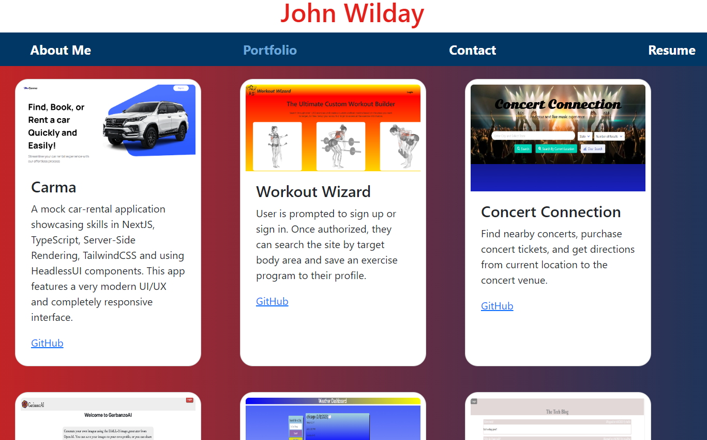

# React Portfolio

## Description
An app that presents my web developer portfolio.

## Screenshot of Application

## Table of Contents
- [Installation](#Installation)
- [Usage](#Usage)
- [License](#License)
- [Contributing](#Contributing)
- [Tests](#Tests)
- [Questions](#Questions)
## Installation
Type "npm run start" on the Terminal command line.
## Usage
Click on the link to the deployed page below. Navigate to the various sections of the site by clicking on the words on the nav bar. 
## License
This application is licensed under MIT.
## Contributing
N/A
## Tests 
None
## Questions
Please email me at johnwilday@yahoo.com with any questions. 
## Deployed Site Link
https://999888z.github.io/react-portfolio/

Github Repo: https://github.com/999888Z/react-portfolio